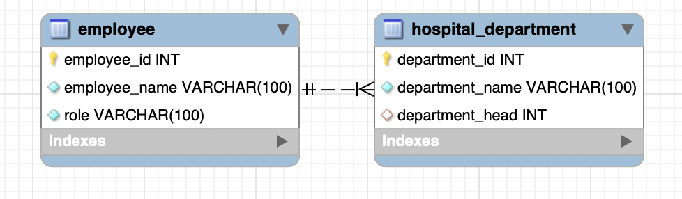
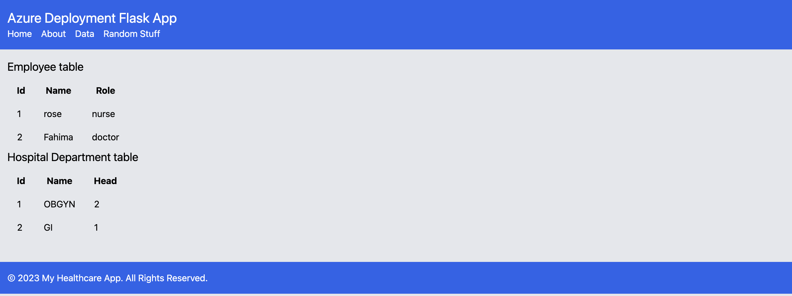

# flask_4_databases_mysql_vm
This is assignment 4B for HHA504

# The VM and MySQL setup process.

## Virtual Machine Setup:
First I began by logging into my Azure account using my stonybrook email. 
I then located virtual machines in either the hamburger icon or in the search bar. 
I then clicked on create a machine. 
In the Basics tab I made sure the Subscription was set to Azure for students. I created a new resource group and titled it Fahima504 and for Virtual machine name I named it FahimaMySQL. For Region I set it to (US)East US and I left Availability zone to Zone 1.  
I set Security type to Standard. For Size I clicked see all sizes and selected B-Series drop down and selected B1ms. for Authentication type I clicked the Password option and set a username and password. 
For Inbound port rules I clicked on the drop down and along with SSH I also selected HTTP and HTTPS. 
In Disks I left everything at default.
In Networking I clicked Delete public IP and NIC when VM is deleted. 
I uncliked Enable backup under Backup
I left everything at default in Monitoring, Advanced, and Tags tab.
My price was set at 0.0207 USD/HR then hit create 
I then navigated to the search bar on top center and searched Virtual machines, and clickled name of my new resource/instance created. 

### MySQL Set-up 
To connect my machine/instance to MySQL I basically followed all the steps professor Hants did during class 5. 
I first went to Google Shell and in the terminal (black bottom part). 
I typed ssh first then ssh fahimal@Ip Address (user name is whatever I used to set up instance found in connect the IP Adress is also there).
Then typed yes, then type in password (whatever password used to set up azure machine).
Made sure I get into my azure machine name. 
Then typed sudo apt-get update and should get done. 
Typed sudo apt install mysql-client mysql-server 
then typed Y
Then typed mysql and should get a access deny response 
Then typed sudo mysql and should get mysql>

#### To connect to workbench username 
Typed create user 'Flakhii'@'%' identified by 'password'; (I used the same password as the azure password and created a new username from azure)
Typed select user from mysql.user;
Typed Grant all privileges on *.* to 'Flakhii'@'%' with grant option; 

Now to ensure proper connectionn to MySQL: 
I go back to Azure account and go to the machine I created. I navigated to networking tab on the left hand side, then clicked add inbound port rule and under service drop down I click MySQL then clicked add.  

### To connect to MySQL workbench: 
I Made a new SQL workbench. Typed anything for connection. For hostname put in IP address for user name put in the user name created in shell shell -- Flakhii and the password used in shell. 
I went back to shell and typed in sudo nano 
/etc/mysql/mysql.conf.d/mysqld.cnf
I changed bind-adress and mysqlx-bind-address to 0.0.0.0
I hit control o to save and hit enter and then  control x to get out.  
I was then able to connect to MySQL Workbench. 

# Rationale behind schema

I created two tables. My first table was titled employee and it contained employee_id, employee_name, and role. The primary key was employee_id. The second table was titled hospital_department and it incorporated department_id, department_name, and department_head, and the foreign key was department_head which was connected to employee_id. The primary key was department_id. 

## Steps and challenges from the database migration process.

### I organized my 2 tables on a note pad to help me visualize and understand it better. 

CREATE TABLE hospital_department (
    department_id INT PRIMARY KEY AUTO_INCREMENT,
    department_name VARCHAR(100) NOT NULL,
    department_head INT,
    FOREIGN KEY (department_head) REFERENCES employee(employee_id)
);

CREATE TABLE employee (
employee_id INT PRIMARY KEY AUTO_INCREMENT,
employee_name VARCHAR(100) NOT NULL,
role VARCHAR(100) NOT NULL
);

### To insert fake values into my table: 

INSERT INTO employee (employee_name, role) VALUES (‘rose’, ‘nurse’);
INSERT INTO employee (employee_name, role) VALUES (‘Fahima’, ‘doctor’);

INSERT INTO hospital_department (department_name, department_head) VALUES (‘OBGYN’, ‘2’); 
INSERT INTO hospital_department (department_name, department_head_ VALUES (‘GI ‘, ‘1,’);

The code to add fake data I just had to do some good old google search, but it was simple to figure out. 

# Documented code errors and your troubleshooting attempts.
I did not really face any code errors or have any trobleshooting issues. The steps were very clear in class on how to set up a virtual machine and how to connect to MySQL. I decided to stick to Azure just because I am more comfortable with it and familiar. I used previous codes from our passed assigments to help me make my tables. 

## Screenshot of application

